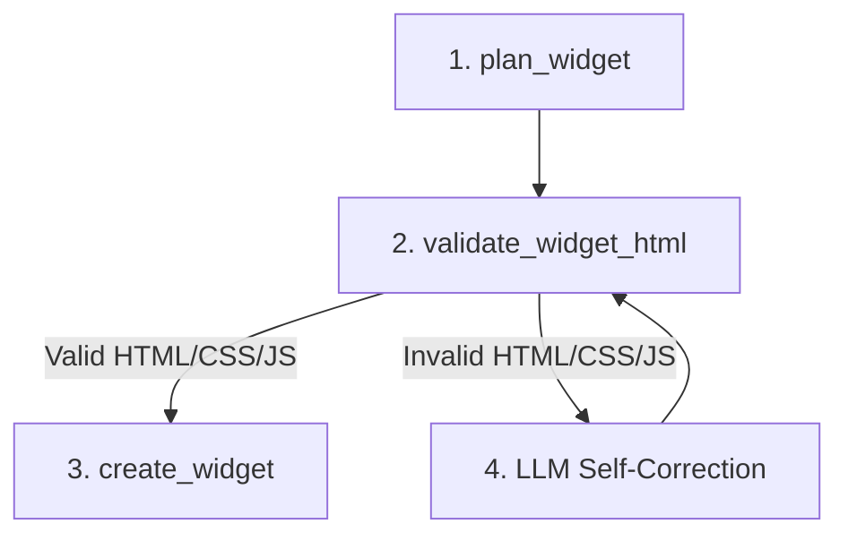

# HTML-Notes Widget System

The `lazy-tool-service` manages widget creation, planning, and schema enforcement for the HTML-Notes dashboard.

## Widget Generation Lifecycle

To prevent layout breakages and partial model output crashes, the agent follows a strict lifecycle:



1. **`plan_widget`**: Enforces a planning step before any visual edits are committed.
2. **`validate_widget_html`**: Verifies that generated HTML has closed tags and is clean.
3. **`create_widget` / `update_widget`**: Generates layout wrappers, scopes CSS to `#{widgetId}`, and runs JavaScript inside encapsulated IIFEs.

---

## Tool Contracts

### `plan_widget`
Parameters:
* `widgetType`: enum (`checklist`, `clock`, `notes`, `iframe_app`, `mini_music_player`, `youtube_player`, `custom`)
* `title`: string
* `description`: A short behavior summary.

### `create_widget`
Parameters:
* `widgetType`: enum
* `title`: string
* `htmlContent`: string (HTML layout)
* `cssContent`: string (optional, styled rules)
* `jsContent`: string (optional, encapsulated script logic)

### `update_widget`
Parameters:
* `widgetId`: string (required)
* `title`: string (optional)
* `htmlContent`: string (optional)
* `cssContent`: string (optional)
* `jsContent`: string (optional)

---

## Scoping Rules

### CSS Isolation
CSS stylesheet rules are automatically scoped to prevent styles bleeding across different widgets or polluting the main dashboard canvas. A selector like `.title { font-weight: bold; }` is rewritten to `#widget-1234 .title { font-weight: bold; }`.

### JavaScript Encapsulation
JavaScript contents are automatically executed within an IIFE (Immediately Invoked Function Expression) with a context-restricted `container` variable bound to the parent widget container element:
```javascript
(function() {
  const container = document.getElementById('widget-1234');
  // Widget script content goes here...
})();
```
This prevents pollution of the global `window` object and isolates widget logic.
